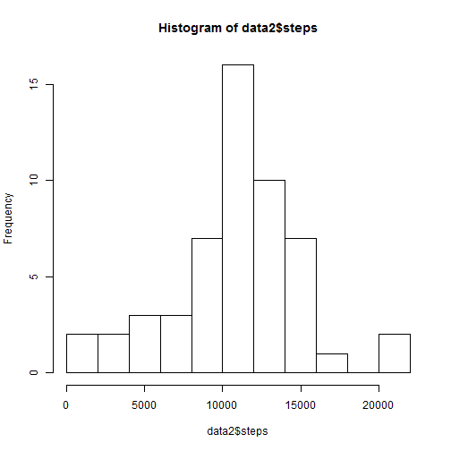
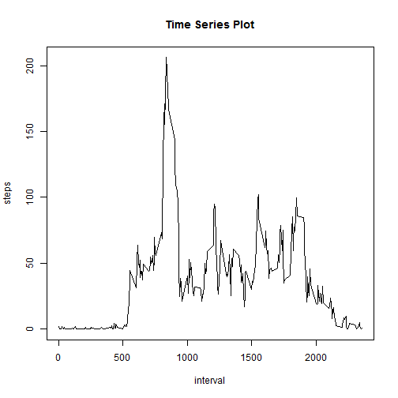
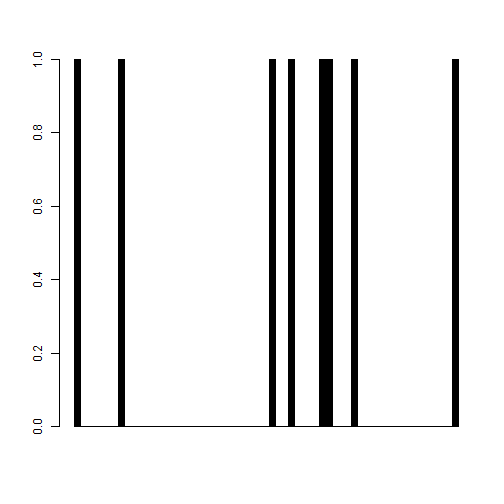
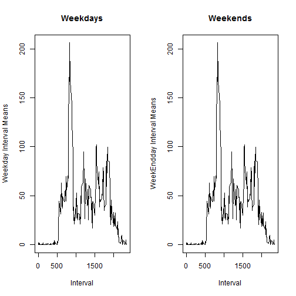

Assignment 1 for Week 2
=======================================

# Zhongrun Xiang
2016-07-16

## Introduction
The file is for Course Project 1 at Coursera.

## Codes

1, Code for reading in the dataset and/or processing the data.


```r
# read data
data1 <- read.csv('activity.csv',stringsAsFactors = FALSE)
```

2, Histogram of the total number of steps taken each day.


```r
# create a histogram
data2<-aggregate(steps~date, data1, sum)
hist(data2$steps, breaks = 10)
```



3, Mean and median number of steps taken each day.


```r
# calculate mean and median
mean1<-mean(data2$steps)
median1<-median(data2$steps)
print(paste("Mean steps per day are",as.character(round(mean1)),sep = " "))
```

```
## [1] "Mean steps per day are 10766"
```

```r
print(paste("Median steps per day are",as.character(median1),sep = " "))
```

```
## [1] "Median steps per day are 10765"
```

4, Time series plot of the average number of steps taken.

```r
# create time series plot
data3<-aggregate(steps~interval, data1, mean)
plot(data3, type = "l", main = "Time Series Plot")
```



5, The 5-minute interval that, on average, contains the maximum number of steps.

```r
# which is the max?
print(paste("The maximum steps is at interval",as.character(which.max(data3$steps)),sep = " "))
```

```
## [1] "The maximum steps is at interval 104"
```

6, Code to describe and show a strategy for imputing missing data.


```r
# Calculate missing values
print(paste("Missings of steps are",as.character(sum(is.na(data1$steps))),sep = " "))
```

```
## [1] "Missings of steps are 2304"
```

```r
print(paste("Missings of dates are",as.character(sum(is.na(data1$date))),sep = " "))
```

```
## [1] "Missings of dates are 0"
```

```r
print(paste("Missings of intervals are",as.character(sum(is.na(data1$interval))),sep = " "))
```

```
## [1] "Missings of intervals are 0"
```

```r
# Discover the missing patterns
barplot(is.na(data1$steps))
```



```r
# Fix data and create new dataset
data4 <- data1
for (i in unique(data4$interval)) {
        data4$steps[is.na(data4$steps) & data4$interval == i]<-round(mean(data4$steps[data4$interval == i], na.rm = T))
}
```

7, Histogram of the total number of steps taken each day after missing values are imputed.


```r
# Create histogram for mean and median
data5<-aggregate(steps~date, data4, sum)
hist(data2$steps, breaks = 10)
```


```r
mean2<-mean(data5$steps)
median2<-median(data5$steps)
print(paste("Mean steps per day are",as.character(round(mean2)),sep = " "))
```

```
## [1] "Mean steps per day are 10766"
```

```r
print(paste("Median steps per day are",as.character(median2),sep = " "))
```

```
## [1] "Median steps per day are 10762"
```

```r
print(paste("Difference on Mean is",as.character(mean1-mean2),sep = " "))
```

```
## [1] "Difference on Mean is 0.549334982986693"
```

```r
print(paste("Difference on Median is",as.character(median1-median2),sep = " "))
```

```
## [1] "Difference on Median is 3"
```
8, Panel plot comparing the average number of steps taken per 5-minute interval across weekdays and weekends.


```r
# Assign weekdays/weekends
data4$day<-weekdays(as.Date(data4$date))
data4$daytype<-"weekdays"
data4[(day=="Sunday")|(day=="Saturday"), 5]<-"weekends"
```

```
## Error in `[<-.data.frame`(`*tmp*`, (day == "Sunday") | (day == "Saturday"), : object 'day' not found
```

```r
# Compare means
data6<-aggregate(steps~daytype, data4, mean)

# Panel plot
dataDays<-subset(data4,daytype="weekdays", select = c(1,3))
dataDays<-aggregate(steps~interval, dataDays,mean)
dataEnds<-subset(data4,daytype="weekends",select = c(1,3))
dataEnds<-aggregate(steps~interval, dataEnds,mean)
par(mfrow = c(1,2))
plot(dataDays,type = "l", main = "Weekdays", ylab = 'Weekday Interval Means',xlab = 'Interval')
plot(dataEnds,type = "l", main = "Weekends", ylab = 'WeekEndday Interval Means', xlab = 'Interval')
```




